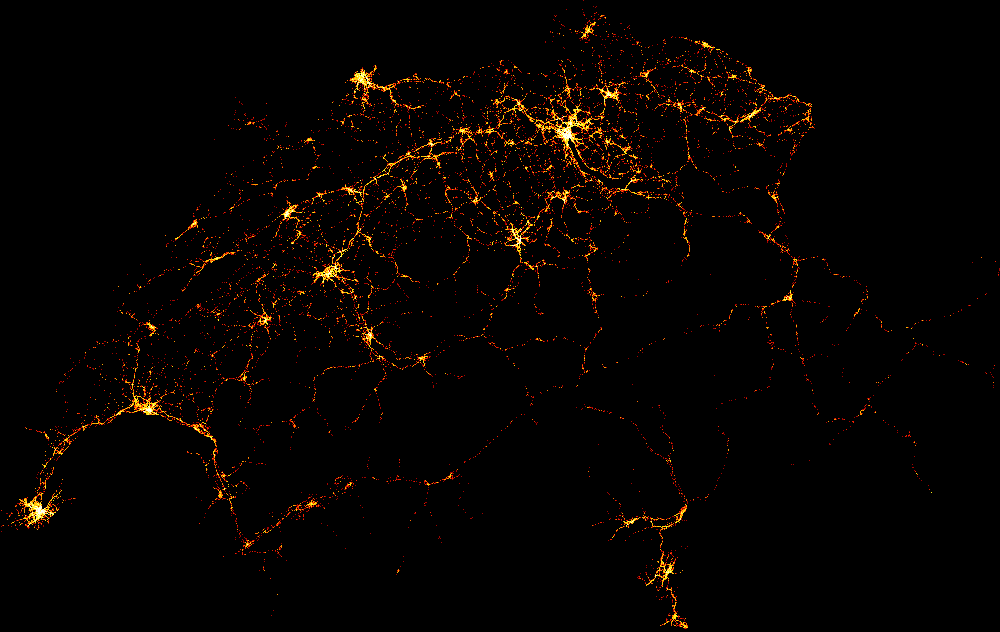
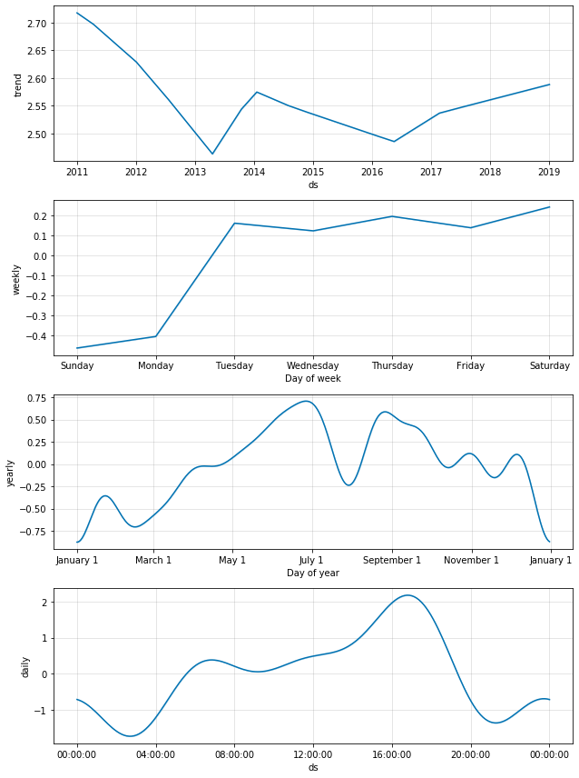

# ChRoadAccidents
## Visualization, analysis and forecasting of road traddic accidents in Switzerland

Forecast and analysis of road traffic accidents in switzerland using the "Strassenverkehrsunfallorte" dataset available at the following address: https://opendata.swiss/en/dataset/strassenverkehrsunfalle-mit-personenschaden

Planned Work:

    Accidents localisation visualization.
    Accidents number forecasting for 2019
    Accidents number forecasting for 2018 to check that it matches with reality
    Accidents with fatalities analysis (TBD)

